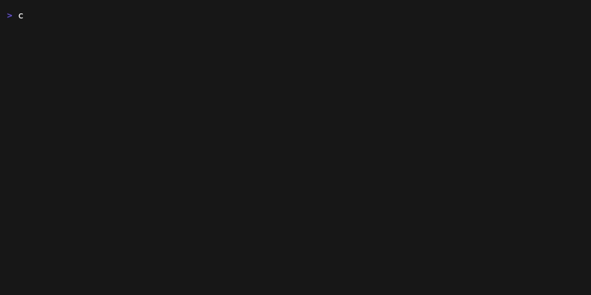

<h1 align="center">cryptofetch</h1>

<p align="center">
    
    
    
    
</p>

<p align="center">
    
</p>

A neofetch-style terminal application for displaying cryptocurrency prices and statistics.

## Features

- Display cryptocurrency data in a beautiful neofetch-style layout
- ASCII art for popular cryptocurrencies (Bitcoin, Ethereum, Cardano, Solana, Ripple, Dogecoin, Polkadot)
- Real-time price data from CoinGecko API
- Price change percentages for 1h, 24h, and 7d
- Market cap, volume, and rank information
- Color-coded price changes (green for positive, red for negative)

## Examples

```bash
# Show Bitcoin data
cryptofetch

# Show Ethereum data
cryptofetch --cur ethereum

# Show Cardano data
cryptofetch --currency cardano

# Show Dogecoin data
cryptofetch --cur dogecoin
```

---

## Installation

Choose your preferred installation method:

### Package Managers (Recommended)

#### Arch Linux (AUR)

```bash
yay -S cryptofetch
# or
paru -S cryptofetch
```

#### macOS / Linux (Homebrew)

```bash
brew tap julianyaman/cryptofetch
brew install cryptofetch 
```

### Direct Installation

#### Quick Install Script

```bash
# Install to /usr/local/bin (requires sudo)
curl -sSL https://raw.githubusercontent.com/julianYaman/cryptofetch/main/scripts/install.sh | bash

# Install to custom location (no sudo required)
curl -sSL https://raw.githubusercontent.com/julianYaman/cryptofetch/main/scripts/install.sh | bash -s -- --prefix=$HOME/.local
```

#### Go Install

```bash
go install github.com/julianYaman/cryptofetch@latest
```

### Manual Download

Download pre-built binaries from the [Releases](https://github.com/julianYaman/cryptofetch/releases) page.

Available platforms:

- **Linux:** amd64, arm64, 386, arm
- **macOS:** amd64 (Intel), arm64 (Apple Silicon)
- **Windows:** amd64, arm64

After downloading:

```bash
# Linux/macOS
chmod +x cryptofetch-*
sudo mv cryptofetch-* /usr/local/bin/cryptofetch

# Windows
# Move cryptofetch-windows-*.exe to a directory in your PATH
```

---

## Usage

### Basic Usage

Display Bitcoin information (default):

```bash
cryptofetch
```

### Specify a Cryptocurrency

Using the `--currency` flag:

```bash
cryptofetch --currency ethereum
```

Using the `--cur` shorthand:

```bash
cryptofetch --cur solana
```

### Get Help

```bash
cryptofetch --help
```

### Check Version

```bash
cryptofetch --version
```

---

## Supported Cryptocurrencies

The application supports any cryptocurrency available on CoinGecko.

For the full list, visit [CoinGecko](https://www.coingecko.com/) and use the coin's ID (usually the lowercase name).

---

## Data Displayed

- **Price**: Current price in USD
- **Market Cap**: Total market capitalization
- **Market Rank**: Ranking by market cap
- **24h Volume**: Trading volume in the last 24 hours
- **24h High/Low**: Highest and lowest prices in the last 24 hours
- **Price Changes**: Percentage changes over 1h, 24h, and 7d

---

## Building from Source

If you want to build cryptofetch yourself:

### Requirements

- Go 1.21 or higher

### Build Steps

```bash
# Clone the repository
git clone https://github.com/julianYaman/cryptofetch.git
cd cryptofetch

# Build with optimizations
go build -ldflags="-s -w" -trimpath -o cryptofetch main.go

# Optional: Compress with UPX (reduces size by ~60%)
upx --best --lzma cryptofetch

# Test the binary
./cryptofetch --version
./cryptofetch --cur bitcoin
```

---

## Contributing

Contributions are welcome! Feel free to:

- Report bugs via [GitHub Issues](https://github.com/julianYaman/cryptofetch/issues)
- Suggest new features
- [Add more ASCII art for cryptocurrencies](./docs/add_new_currencies.md)
- Please commit in this format: `feat: add new feature`, `fix: fix bug`, etc.

### Development Setup

```bash
# Clone the repository
git clone https://github.com/julianYaman/cryptofetch.git
cd cryptofetch

# Make changes to main.go

# Test your changes
go run main.go --cur bitcoin
```

---

## License

MIT License - feel free to use this project however you'd like! See [LICENSE](LICENSE) for details.

---

## Acknowledgments

- Data provided by [CoinGecko API](https://www.coingecko.com/)
- Inspired by [neofetch](https://github.com/dylanaraps/neofetch)
- ASCII art generated with [Dot Art Generator](https://emojicombos.com/dot-art-generator)

---

## Author

**Julian Yaman**
- Website: [yaman.pro](https://yaman.pro)
- GitHub: [@julianYaman](https://github.com/julianYaman)
- Email: mail@yaman.pro

---

**Star this project if you find it useful!** ⭐
